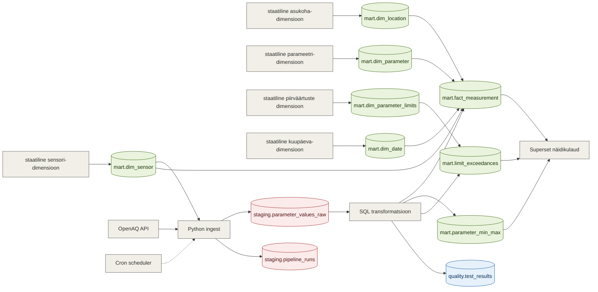

# Eesti õhukvaliteedi seire

## Äriküsimus

Kuidas erineb õhukvaliteet Eesti suuremates linnades (Tallinna, Tartu, Narva) ning kui sageli ületavad peamised saasteained kehtestatud õhukvaliteedi piirväärtuseid? 


**Mõõdikud:**

1. Päevane näitajate kõikumine (min/max + aeg)
2. Piirväärtuste ületamise arv mingis ajaühikus (seadus määrab ületamiseks erinevad keskmistamise perioodid)
3. Domineeriv saasteaine eri linnades (st milline on European Air Quality Index’i määraja) (kui jõuame)


## Arhitektuur



Täpsem kirjeldus: [`docs/arhitektuur.md`](docs/arhitektuur.md)

## Andmestik

| Allikas | Tüüp | Ajas muutuv? | Roll |
|---------|------|--------------|------|
| OpenAQ API | Avalik HTTP API | Jah, iga 1 tund, 2-3 tunnise viitega reaalajast | Põhiandmevoog |
| mart.dim_location | Staatiline dimensioonitabel | Ei, staatiline | Asukohtade püsivad tunnused ja API päringu koordinaadid |
| mart.dim_parameter | Staatiline dimensioonitabel | Ei, staatiline | Saasteainete püsivad tunnused |
| mart.dim_parameter_limits | Staatiline dimensioonitabel | Ei, staatiline | Saasteainete piirväärtused Eestis/EUs |
| mart.dim_sensor | Staatiline dimensioonitabel | Ei, staatiline | Sensorite püsivad tunnused |

## Stack

| Komponent | Tööriist |
|-----------|---------|
| Sissevõtt | Python |
| Transformatsioon | SQL |
| Andmehoidla | PostgreSQL |
| Näidikulaud | Superset |
| Orkestreerimine | cron |

## Käivitamine

```bash
# 1. Klooni repo ja liigu kausta
git clone <repo-url>
cd <projekti-kaust>

# 2. Kopeeri keskkonnamuutujad
cp .env.example .env
# Muuda .env failis paroolid ja muud seaded vastavalt vajadusele

# 3. Käivita teenused
docker compose up -d --build

# 4. [Vabatahtlik: käivita sissevõtt käsitsi esimesel korral]
# docker compose exec pipeline python scripts/run_pipeline.py run-all
```

Näidikulaud: http://localhost:8088

## Saladused ja konfiguratsioon

Kõik saladused (paroolid, API võtmed, andmebaasi URL-id) on `.env` failis. Repos on ainult `.env.example`, mis näitab vajalike muutujate struktuuri ilma tegelike väärtusteta. Päris `.env` faili ei tohi GitHubi panna - see on `.gitignore`-s.

Vajalikud muutujad:

| Muutuja | Tähendus | Näide |
|---------|----------|-------|
| `DB_PASSWORD` | PostgreSQL parool | (saladus) |
| `[teised]` | ... | ... |

## Andmevoog lühidalt

1. **Sissevõtt** — [Kirjelda, kuidas andmed allikast kätte saadakse]
2. **Laadimine** — Andmed laaditakse `staging` kihti
3. **Transformatsioon** — [Kirjelda peamised arvutused ja mudelid]
4. **Testimine** — [Mitu] andmekvaliteedi testi kontrollivad korrektsust
5. **Näidikulaud** — [Kirjelda lühidalt, mida näidikulaud näitab]

## Andmekvaliteedi testid

Projekt kontrollib järgmist:

1. [Test 1 - nt: kasutajate ID on unikaalne]
2. [Test 2 - nt: tellimuse summa pole null]
3. [Test 3 - nt: kuupäev jääb vahemikku 2020-2026]
[Lisa rohkem, kui sul on]

Testide tulemused: [kuhu salvestatakse / kuidas vaadata]

## Projekti struktuur

```
.
├── README.md
├── compose.yml
├── .env.example
├── .gitignore
├── docs/
│   ├── arhitektuur.md      ← nädal 1 väljund
│   └── progress.md         ← nädal 2 väljund
└── ...                     ← ülejäänud projektifailid
```

## Kokkuvõte, puudused ja võimalikud edasiarendused

**Kokkuvõte:**
- [Loetle, mis on lõpule viidud, mis töötab hästi]

**Puudused:**
- [Loetle ausalt, mis jäi tegemata - see ei mõjuta hinnet negatiivselt, vaid aitab hinnata]

**Mis edasi:**
- [Mida tahaksid edasi teha, kui aega oleks rohkem]

## Meeskond

| Nimi | Roll |
|------|------|
| Keit Prants | Andmeallika omanik |
| Laura Edenberg | Transformatsioonide omanik |
| Anni Burk | Kvaliteedi omanik |
| Merje Pungits | Näidikulaua omanik |
