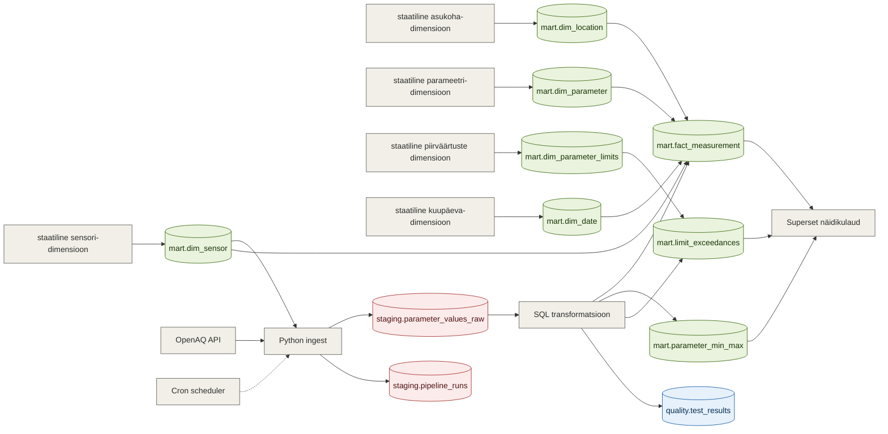

# Arhitektuur

## Äriküsimus

Kuidas erineb õhukvaliteet Eesti suuremates linnades (Tallinna, Tartu, Narva) ning kui sageli ületavad peamised saasteained kehtestatud õhukvaliteedi piirväärtuseid? 

## Mõõdikud

1. Päevane näitajate kõikumine (min/max + aeg)
2. Piirväärtuste ületamise arv mingis ajaühikus (seadus määrab ületamiseks erinevad keskmistamise perioodid)
3. Domineeriv saasteaine eri linnades (st milline on European Air Quality Index’i määraja) (kui jõuame)

## Andmeallikad

| Allikas | Tüüp | Ajas muutuv? | Roll |
|---------|------|--------------|------|
| OpenAQ API | Avalik HTTP API | Jah, iga 1 tund, 2-3 tunnise viitega reaalajast | Põhiandmevoog |
| mart.dim_location | Staatiline dimensioonitabel | Ei, staatiline | Asukohtade püsivad tunnused ja API päringu koordinaadid |
| mart.dim_parameter | Staatiline dimensioonitabel | Ei, staatiline | Saasteainete püsivad tunnused |
| mart.dim_limit | Staatiline dimensioonitabel | Ei, staatiline | Saasteainete piirväärtused Eestis/EUs |

## Andmevoog





## Andmebaasi kihid

| Kiht | Roll |
|------|------|
| `staging` | Hoiab allika andmeid töötlemata kujul. |
| `mart` | Hoiab transformeeritud ja äriloogikat sisaldavaid tabeleid. |
| `quality` | Hoiab kvaliteeditestide tulemusi. |

## Tööjaotus

| Roll | Vastutus | Täitja |
|------|----------|--------|
| Andmeallika omanik | Kirjutab sissevõtu loogika, hoiab API-t töös | Keit |
| Transformatsioonide omanik | Kirjutab mart kihi mudelid ja mõõdikute arvutuse | Laura |
| Kvaliteedi omanik | Kirjutab testid ja vaatab läbi ebaõnnestunud kontrollid | Anni |
| Näidikulaua omanik | Ehitab näidikulaua ja seob selle äriküsimusega | Merje |

## Riskid

| Risk | Mõju | Maandus |
|------|------|---------|
|API andmed pole stabiilsed või puuduvad osad| Andmevoog katkeb, dashboard näitab puudulikke andmeid | Andmekvaliteedi testid, logid, fallback viimase eduka laadimise andmetele |
|Õhukvaliteeti mõõtev sensor vahetatakse välja ja uus sensor saab uue id| Andmed ei uuene | Andmekvaliteedi testidega |
|API päringute limiidid või katkestused| Andmete laadimine ebaõnnestub, scheduler jääb tsüklisse | Retry loogika, scheduler alertid |

## Privaatsus ja turve

Projekt kasutab ainult avalikke õhukvaliteediandmeid. Isikuandmeid ei töödelda. 
Andmebaasi ja API võtmete ligipääsuandmed hoitakse .env failis, mida ei lisata GitHubi (fail on kirjas .gitignore failis).

## API ühenduse testimine

```bash
# 1. Klooni repo ja liigu kausta
git clone <repo-url>
cd <projekti-kaust>

# 2. Kopeeri keskkonnamuutujad
cp .env.example .env
# Muuda .env failis OpenAQ API key

# 3. Käivita teenused
docker compose up -d --build

# 4. Käivita testscript andmete päringu testimiseks
docker compose exec pipeline python scripts/data_from_api.py
```

## Lisainfo

Definitsioonide allikas https://www.riigiteataja.ee/akt/122122018007#para47lg1

Õhukvaliteedi piirväärtus on saasteaine lubatav kogus välisõhu ruumalaühikus või pinnaühikule sadestunud saasteaine lubatav kogus, mis on kehtestatud teaduslike andmete alusel ning mis nimetatud koguse ületamise korral tuleb saavutada kindlaksmääratud aja jooksul ja mida edaspidi ei tohi enam ületada. Piirväärtuse kehtestamise eesmärk on vältida, ennetada või vähendada saasteaine ebasoodsat mõju inimese tervisele või keskkonnale.

Õhukvaliteedi sihtväärtus on saasteaine kogus välisõhu ruumalaühikus või pinnaühikule sadestunud saasteaine kogus, mis tuleb nimetatud koguse ületamise korral saavutada asjakohaste meetmetega, mis ei too kaasa ebaproportsionaalselt suuri kulutusi, kas kindlaksmääratud aja jooksul või võimalikult kiiresti ja mille eesmärk on parandada õhukvaliteeti ja vältida või vähendada ebasoodsat mõju inimese tervisele ja keskkonnale.

Õhukvaliteedi kriitiline tase on saasteaine kogus välisõhu ruumalaühikus või pinnaühikule sadestunud saasteaine kogus, mis on kehtestatud teaduslike andmete alusel ja mille ületamisel võib tõenäoliselt ilmneda vahetu oluline ebasoodne mõju ökosüsteemile või selle osale, välja arvatud inimesele.

Õhukvaliteedi häiretase on õhukvaliteedi piirväärtusest kõrgem saasteaine kogus välisõhu ruumalaühikus või pinnaühikule sadestunud saasteaine kogus, mille ületamisel lühiajaline kokkupuude saastatud õhuga kujutab ohtu inimeste tervisele ja mille ületamise korral tuleb viivitamata rakendada kaitsemeetmeid.

OpenAQ-st saadavad õhukvaliteedi näitajad:
- CO (µg/m³)
- NO₂ (µg/m³)
- O₃ (µg/m³)
- PM2.5 (µg/m³) 
- PM10 (µg/m³)
- SO₂ (µg/m³)
  
Piirväärtuste allikas: https://www.riigiteataja.ee/aktilisa/1060/3201/9012/KKM_m8_lisa1.pdf#

Euroopa õhukvaliteedi indeksi arvutamiseks kasutatakse PM10, PM2.5, NO2, O3 ja SO2 kontsentratsioone. (https://airindex.eea.europa.eu/AQI/index.html#)

| Pollutant | Index level |  |         |      |           |                |
| --------- | ----------- |--| --------| ---- | --------- | -------------- |
|           | Good | Fair | Moderate | Poor   | Very poor | Extremely poor |
| Particles less than 2.5 µm (PM2.5) | 0-5 | 6-15 | 16-50 |	51-90 |	91-140 |	>140 | 
| Particles less than 10 µm (PM10) |	0-15 |	16-45 |	46-120 |	121-195 |	196-270 |	>270 |
| Ozone (O3) |	0-60 |	61-100 |	101-120 |	121-160 |	161-180 |	>180 |
| Nitrogen dioxide (NO2) |	0-10 |	11-25 |	26-60 |	61-100 |	101-150 |	>150 |
| Sulphur dioxide (SO2) |	0-20 |	21-40 |	41-125 |	126-190 |	191-275 |	>275 |
