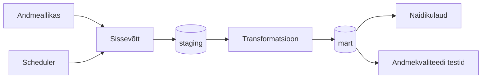

# Arhitektuur

> **Juhend:** See fail on projektitöö esimese nädala väljund. Asenda kõik nurksulgudes plankid oma projekti tegeliku sisuga. Kustuta see juhendrida.

## Äriküsimus

[Kirjuta ühe-kahe lausega oma äriküsimus täpselt. Näiteks: "Millistes kauplustes ja mis kellaaegadel on müügitõhusus (käive külastaja kohta) kõrgeim?"]

Milline on õhukvaliteedi dünaamika Eesti suurimates linnades (Tallinn, Tartu, Narva) ja kas see ületab kriitilisi piirmäärasid?

Allikast saadavad õhukvaliteedi näitajad:

- CO (µg/m³)
- NO₂ (µg/m³)
- O₃ (µg/m³)
- PM2.5 (µg/m³) - see näitaja on Tallinna andmetest puudu (Anni: mulle tundub, et Õismäel mõõdetakse PM2.5 ka)
- PM10 (µg/m³)
- SO₂ (µg/m³)
  
Piirväärtuste allikas: https://www.riigiteataja.ee/aktilisa/1060/3201/9012/KKM_m8_lisa1.pdf#

Anni: Euroopa õhukvaliteedi indeksi arvutamiseks kasutatakse PM10, PM2.5, NO2, O3 ja SO2 kontsentratsioone. Mul üks mõte oli, et valida need näitajad. (https://airindex.eea.europa.eu/AQI/index.html#)

| Pollutant | Index level |  |         |      |           |                |
| --------- | ----------- |--| --------| ---- | --------- | -------------- |
|           | Good | Fair | Moderate | Poor   | Very poor | Extremely poor |
| Particles less than 2.5 µm (PM2.5) | 0-5 | 6-15 | 16-50 |	51-90 |	91-140 |	>140 | 
| Particles less than 10 µm (PM10) |	0-15 |	16-45 |	46-120 |	121-195 |	196-270 |	>270 |
| Ozone (O3) |	0-60 |	61-100 |	101-120 |	121-160 |	161-180 |	>180 |
| Nitrogen dioxide (NO2) |	0-10 |	11-25 |	26-60 |	61-100 |	101-150 |	>150 |
| Sulphur dioxide (SO2) |	0-20 |	21-40 |	41-125 |	126-190 |	191-275 |	>275 |

## Mõõdikud

1. Päevane näitajate kõikumine (min/max + aeg)
2. Näitajate piirmäärade ületamise sagedus (nt kuus, aastas)
3. Hooajalisuse indeks

## Andmeallikad

| Allikas | Tüüp | Ajas muutuv? | Roll |
|---------|------|--------------|------|
| OpenAQ API | Avalik HTTP API | Jah, [iga X tundi / päeva] | Põhiandmevoog |
| mart.dim_location | Staatiline dimensioonitabel | Ei, staatiline | Asukohtade püsivad tunnused ja API päringu koordinaadid |

## Andmevoog

> Täpsusta diagrammi vastavalt oma projektile — lisa rohkem andmeallikaid, mudeleid või teenuseid.

## Andmebaasi kihid

| Kiht | Roll |
|------|------|
| `staging` | Hoiab allika andmeid töötlemata kujul. |
| `mart` | Hoiab transformeeritud ja ärilogikat sisaldavaid tabeleid. |
| `quality` | Hoiab kvaliteeditestide tulemusi. |

## Tööjaotus

| Roll | Vastutus | Täitja |
|------|----------|--------|
| Andmeallika omanik | Kirjutab sissevõtu loogika, hoiab API-t töös | [Nimi] |
| Transformatsioonide omanik | Kirjutab mart kihi mudelid ja mõõdikute arvutuse | [Nimi] |
| Kvaliteedi omanik | Kirjutab testid ja vaatab läbi ebaõnnestunud kontrollid | [Nimi] |
| Näidikulaua omanik | Ehitab näidikulaua ja seob selle äriküsimusega | [Nimi] |

## Riskid

| Risk | Mõju | Maandus |
|------|------|---------|
| [Risk 1 — näiteks: API ei vasta] | [Mis juhtub?] | [Kuidas maandad?] |
| [Risk 2] | [Mis juhtub?] | [Kuidas maandad?] |
| [Risk 3] | [Mis juhtub?] | [Kuidas maandad?] |

## Privaatsus ja turve

Projekt kasutab ainult avalikke õhukvaliteediandmeid. Isikuandmeid ei koguta. Andmebaasi kasutajanimi ja parool tulevad .env failist. Päris .env faili ei tohi reposse lisada.
